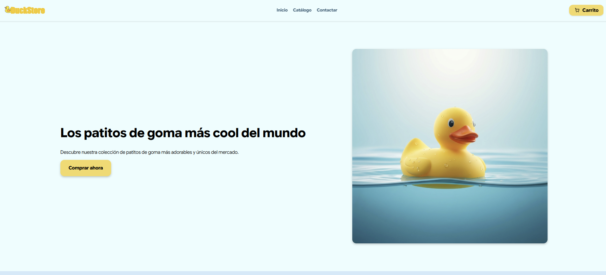
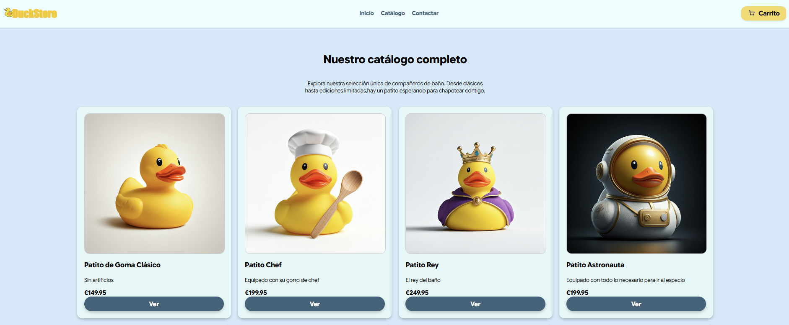
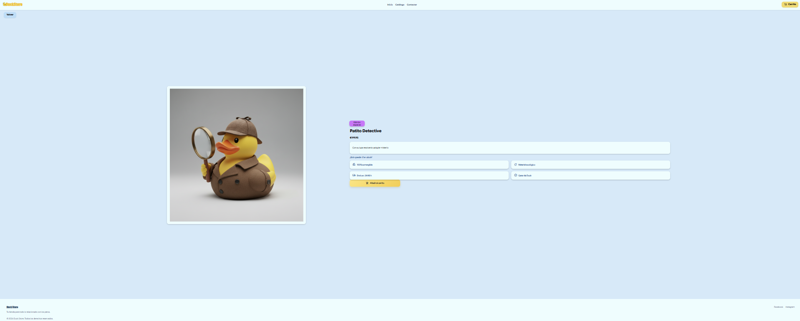
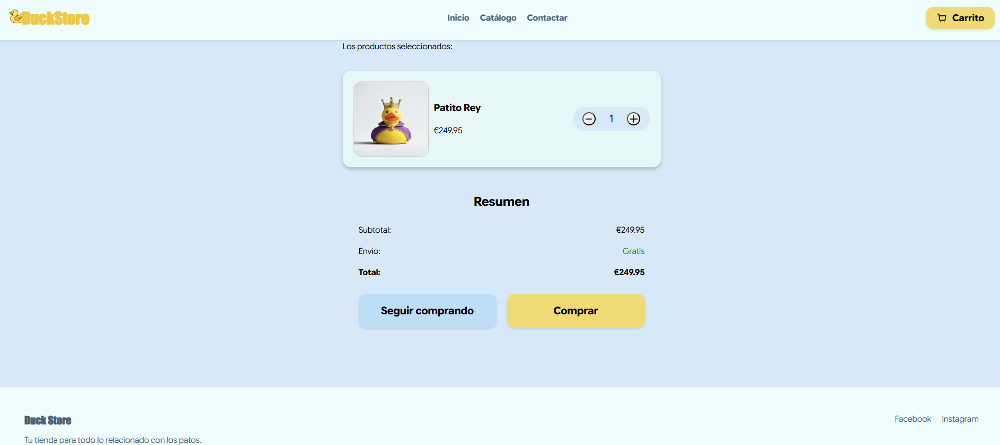
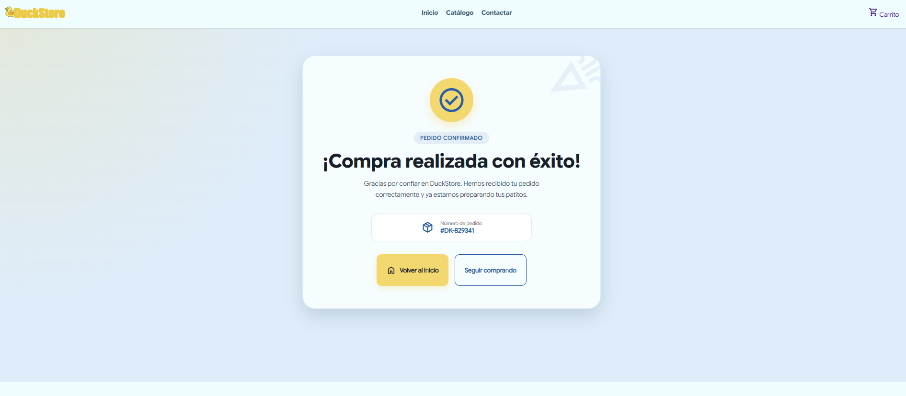

# DuckStore

DuckStore es una tienda online ficticia desarrollada como primer proyecto colaborativo durante las primeras semanas del Bootcamp de Desarrollo Web Full Stack de Factoría F5.

El objetivo principal del proyecto fue aplicar los fundamentos de HTML, CSS y JavaScript, aprender el flujo de trabajo con Git y GitHub y desarrollar una aplicación web en equipo.

**Repositorio:** https://github.com/gmp395/pe-duckstore-team5-digital-academy

**Demo:** https://gmp395.github.io/pe-duckstore-team5-digital-academy/

---

## Índice

- [Descripción](#descripción)
- [Objetivos](#objetivos)
- [Tecnologías utilizadas](#tecnologías-utilizadas)
- [Funcionalidades](#funcionalidades)
- [Estructura del proyecto](#estructura-del-proyecto)
- [Instalación](#instalación)
- [Uso](#uso)
- [Vista de la aplicación](#vista-de-la-aplicación)
- [Aprendizajes](#aprendizajes)
- [Mejoras futuras](#mejoras-futuras)
- [Autoría](#autoría)

---

## Descripción

DuckStore es una tienda online ficticia de patitos de colección desarrollada como primer proyecto colaborativo del Bootcamp de Desarrollo Web Full Stack de Factoría F5.

La aplicación permite explorar un catálogo de productos, consultar el detalle de cada artículo, gestionar un carrito de compra y completar un proceso de compra simulado.

Este proyecto supuso una primera toma de contacto con el desarrollo de aplicaciones web utilizando HTML, CSS y JavaScript, así como con el trabajo colaborativo mediante Git y GitHub.

---

## Objetivos

- Aplicar los fundamentos de HTML5, CSS3 y JavaScript.
- Desarrollar una aplicación web multipágina.
- Manipular el DOM mediante JavaScript.
- Implementar un carrito de compra funcional.
- Practicar el trabajo colaborativo utilizando Git y GitHub.

---

## Tecnologías utilizadas

- HTML5
- CSS3
- JavaScript (ES6)
- LocalStorage
- Git
- GitHub

---

## Funcionalidades

- Página principal.
- Catálogo de productos.
- Vista de detalle de cada producto.
- Carrito de compra.
- Gestión de cantidades de los productos.
- Persistencia del carrito mediante LocalStorage.
- Simulación del proceso de compra.
- Página de confirmación de compra.
- Diseño responsive.

---

## Estructura del proyecto

```text
pe-duckstore-team5-digital-academy/
│
├── assets/
│   ├── db/
│   ├── fonts/
│   ├── icons/
│   ├── images/
│   └── js/
│
├── css/
├── docs/
├── pages/
│
├── .gitignore
├── index.html
└── README.md
```

---

## Instalación

1. Clonar el repositorio.

```bash
git clone https://github.com/gmp395/pe-duckstore-team5-digital-academy.git
```

2. Acceder al directorio del proyecto.

```bash
cd pe-duckstore-team5-digital-academy
```

3. Abrir `index.html` en el navegador o ejecutar el proyecto mediante **Live Server** desde Visual Studio Code.

---

## Uso

1. Acceder a la página principal.
2. Explorar el catálogo de productos.
3. Consultar el detalle de un producto.
4. Añadir productos al carrito.
5. Gestionar las cantidades.
6. Completar el proceso de compra.

---

## Vista de la aplicación

### Página principal

<p align="center">
  
</p>

### Catálogo

<p align="center">
  
</p>

### Detalle del producto

<p align="center">
  
</p>

### Carrito de compra

<p align="center">
  
</p>

### Compra realizada

<p align="center">
  
</p>

---

## Aprendizajes

Este proyecto permitió adquirir experiencia en:

- Desarrollo de interfaces web utilizando HTML y CSS.
- Manipulación dinámica del DOM mediante JavaScript.
- Gestión del estado de una aplicación utilizando LocalStorage.
- Organización de un proyecto frontend.
- Trabajo colaborativo utilizando Git y GitHub.
- Uso de ramas, commits, pull requests y resolución de conflictos durante el desarrollo.

---

## Mejoras futuras

- Integración con una base de datos.
- Sistema de autenticación de usuarios.
- Buscador y filtrado de productos.
- Pasarela de pago.
- Panel de administración para la gestión del catálogo.

---

## Autoría

Proyecto desarrollado en equipo durante el Bootcamp de Desarrollo Web Full Stack de Factoría F5.

**Integrantes del equipo**

- Gema Miguel 
- Nerea Sola
- Charles Baltazar
- Daniel Muntyanu
  
